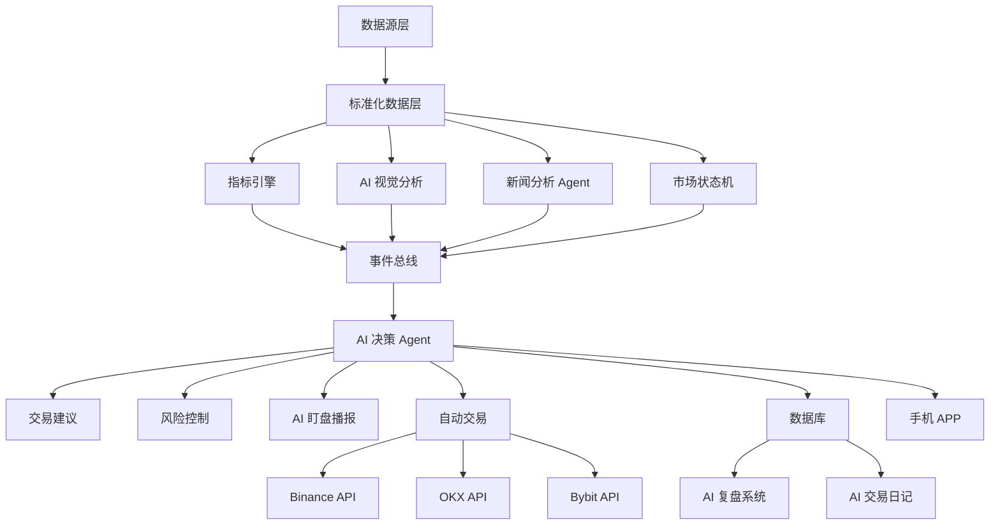

# AI Trading OS（AI 交易操作系统）

独立规格与代码存放区，与桌面 Accomplish 应用解耦。定位为：**AI 交易副驾驶 / AI 市场观察系统**。

## 核心目标

- 持续观察市场、自动分析 K 线结构  
- 结合新闻与宏观、识别交易机会  
- AI 持仓管理、半自动 / 全自动交易  
- 手机 APP 部署、SaaS 订阅  

**V1 优先**：AI 盯盘 + AI 解释（暂缓自动下单以降低合规与工程风险）。

---

## 总体架构（逻辑）

---

## 双数据源

| 路径 | 模式 | 适用 |
|------|------|------|
| **A（主）** | API | Binance / OKX / Bybit、股票 API；低资源、高速度、适合自动交易 |
| **B（兼容）** | 视觉 + OCR | TradingView、文华、同花顺、直播间、拍屏；方向键移 K 线 → OCR OHLC → 结构化存储 |

---

## 目录说明

| 目录 | 用途 |
|------|------|
| `app/` | 入口或编排（按最终实现选型补充） |
| `backend/` | FastAPI 等服务端 |
| `ai/` | 轻量模型、推理编排、Prompt |
| `ocr/` | PaddleOCR / EasyOCR / Tesseract 等采集管线 |
| `indicators/` | EMA、RSI、MACD、布林带、ATR、波动率、squeeze 等 |
| `news/` | NewsAPI、Finnhub、快讯与宏观数据源适配 |
| `agents/` | 新闻 Agent、决策 Agent、多 Agent 协同 |
| `trading/` | 交易所 API、下单与路由（V4+ 重点） |
| `database/` | SQLite / DuckDB  schema 与迁移 |
| `websocket/` | 实时行情与推送 |
| `mobile/` | Flutter 客户端（V5） |
| `voice/` | ChatTTS、CosyVoice 等播报 |
| `replay/` | 复盘与交易日记 |
| `docs/` | 补充设计文档 |

---

## 技术栈备忘

- **移动端**：Flutter（推荐）  
- **后端**：FastAPI  
- **本地库**：SQLite 或 DuckDB  
- **事件驱动**：仅在「状态变化 / 触发事件」时调用大模型，降低消耗  

---

## 本地开源模型（免费权重）

在 `ai-trading-os/models/` 存放 Hugging Face 下载的权重（已 `.gitignore`，不入库）。安装与一键下载见 **`models/README.md`**；脚本为 `scripts/download_models.py`，依赖见 `requirements-models.txt`。

推荐一键包含：**DeepSeek-R1 蒸馏**（`DeepSeek-R1-Distill-Qwen-1.5B`）、**SenseNova-U1**（`--with-sensenova`，体积大）、**ChatTTS**、**CosyVoice-300M**（使用 `python scripts/download_models.py --recommended`，按需再加 `--with-sensenova`）。

---

## 版本路线（摘要）

| 阶段 | 内容 |
|------|------|
| **V1** | API K 线 + 可选 OCR、JSON 存储、EMA/RSI、触发后 AI 分析、Telegram 推送 |
| **V2** | 市场状态机、事件总线、新闻 Agent、AI 总结 |
| **V3** | 语音播报、自动复盘、AI 交易日记 |
| **V4** | 半自动交易、API 下单、风险管理 |
| **V5** | 手机 APP、SaaS、多账户、多 Agent |

---

## 外部参考（链接）

- 交易所：Binance / OKX / Bybit 官方 API 文档  
- TradingView：Webhook、Pine Script  
- 新闻与宏观：NewsAPI、Finnhub、Alpha Vantage、FRED、TradingEconomics  
- 加密衍生品数据：Coinglass 等  
- 轻量模型：Qwen2.5、DeepSeek-R1、Phi-3 Mini  
- 视觉：SenseNova-U1、Qwen2.5-VL  
- 语音：ChatTTS、CosyVoice  

具体密钥与接入方式勿提交入仓库，使用环境变量与私密配置。
